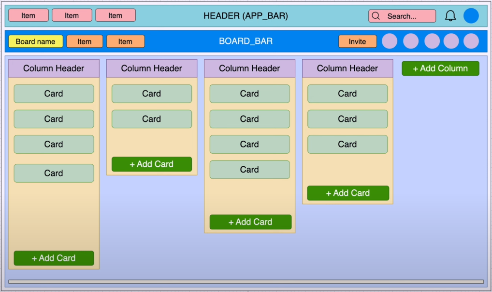
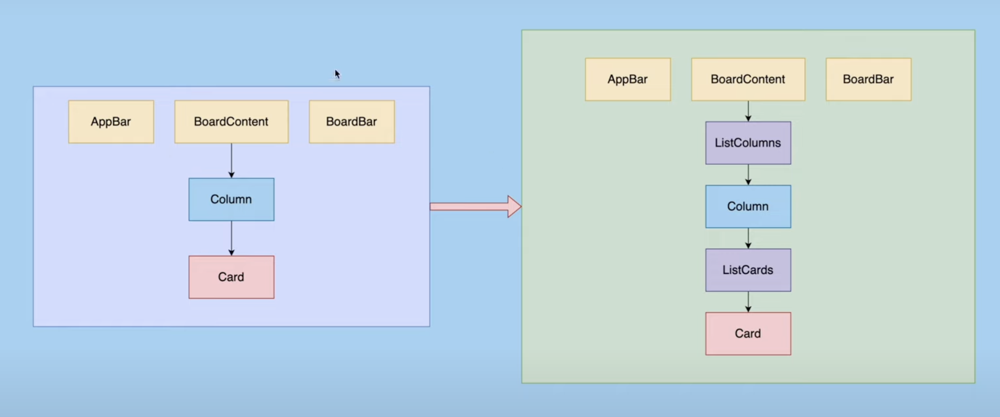

# Trello Web App

**Description:** A full-stack MERN Trello application for managing tasks.

## 🎈 Introduction
The Trello App is a web application designed to streamline task management. It offers a user-friendly interface for creating, viewing, updating, and deleting tasks efficiently.

## 🎯 Features
- Task Creation
- Task Viewing
- Task Updating
- Task Deletion

## 🛠️ Technologies
- **Frontend:** React, React Hooks, Material Design UI
- **State Management:** Redux, Redux Toolkit
- **Build Tool:** Vite

## 🚀 Setup
1. **Clone the Repository:**
   https://github.com/phattran1023/trello-web.git

2. **Install Dependencies:**
   ```cmd
   nvm use 18.16.0
   cd trello-web
   yarn install
   yarn dev
# 📚 Project Phases

## Phase 1: Front-end Development
- Framework: React
- Concepts: JSX vs JS, Semantic Versioning, Clean Code
- UI Library: Material Design UI
- State Management: Redux, Redux Toolkit


## 📖 Reference Documents
1. **Environment Set-up**
  - NodeJS: [https://nodejs.org/en](https://nodejs.org/en)
  - Git: [https://git-scm.com/](https://git-scm.com/)
  - Yarn: [https://classic.yarnpkg.com/lang/en/d...](https://classic.yarnpkg.com/lang/en/docs/install/#mac-stable)
  - Vite: https://vitejs.dev/guide/
  - NVM: https://github.com/nvm-sh/nvm#install--update-script
  - ESlint: https://eslint.org/docs/latest/use/getting-started
  - @mui/material: https://www.npmjs.com/package/@mui/material
  - @emotion/react: https://www.npmjs.com/package/@emotion/react
  - @emotion/styled: https://www.npmjs.com/package/@emotion/styled
  - @mui/icons-material: https://www.npmjs.com/package/@mui/icons-material

2. **📐 Trello Web App Layout Analysis**


3. **🏗️ Components structure**


4. **🔍 Sort Data**
-Optional Chaining, Object Destructuring, String charAt, String toUpperCase, Array Slice, Spread Operator, Array sort, Array indexOf
- React map keys:
https://legacy.reactjs.org/docs/lists-and-keys.html
- Clone Array:
https://www.freecodecamp.org/news/how-to-clone-an-array-in-javascript-1d3183468f6a/

5. **Dnd-kit, Drag, and Drop Research**
- dnd-kit: https://dndkit.com
- Which drag and drop library should use?: https://levelup.gitconnected.com/say-goodbye-to-react-dnd-hello-to-dnd-kit-the-future-of-drag-and-drop-is-here-6aa488f17a0
- Dnd-kit: https://www.npmjs.com/package/@dnd-kit/core
- Dnd-kit-sortable: https://www.npmjs.com/package/@dnd-kit/sortable
- dnd-utilities: https://www.npmjs.com/package/@dnd-kit/utilities
- Dnd-sensor: https://docs.dndkit.com/api-documentation/sensors
